# **MAGIC**

## **Setup:**

1) Fork the GitHub repo (https://github.com/FDUDSDE/MAGIC)

2) Clone the GitHub repo (https://github.com/m-shayan73/MAGIC)
   
3) Mac/Windows:
   
   1) Only certain versions of the dgl library can be installed via the pip command. (available versions: 2.1.0 and 2.2.0 on Mac and 0.1.2, 0.1.3, and 2.2.1 on Windows).
   
   2) Each version of dgl is compatible with certain versions of pytorch. However, even when using compatible versions I was getting the following error when I tried running eval.py.  
   
      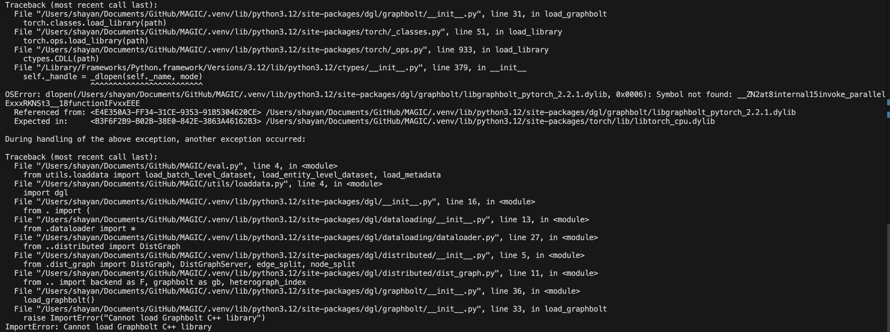

   3) Newer versions of the dgl library are available for build from source. However, I was not able to build them successfully and got the following error each time I tried.
      
      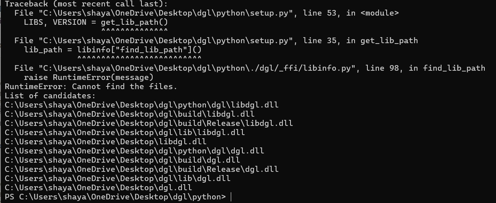
      
4) Linux:
   
   1) After failing to deal with the dependencies on Windows and Mac, I tried running MAGIC on a virtual machine running Linux (Ubuntu 24.04.1) via VMWare Fusion Pro.
   
   2) Dependencies used: Python 3.8, PyTorch 1.12.1, DGL 1.0.0, Scikit-learn 1.2.2 (same as mentioned in MAGIC's official repository)

## **Running and Evaluating the MAGIC:**

1) Streamspot Dataset:
   
   1) The Github repo mentions that preprocessing streamspot dataset will result in 600 graphs (500 benign and 100 malicious). ~~However, when I tried preprocessing it, only 435 json files are created and then the following error appears:~~

      ~~~~

      **Update:** It was probably a memory issue as the entire file is loaded into memory at once. I was able to generate 600 graphs after increasing the VM’s RAM allocation.

   2) It appears that the code includes some benign data used during training for evaluation purposes as well. The prediction algorithm uses KNN so might inflate the evaluation metrics.

      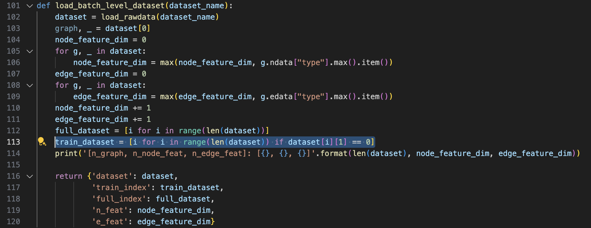

      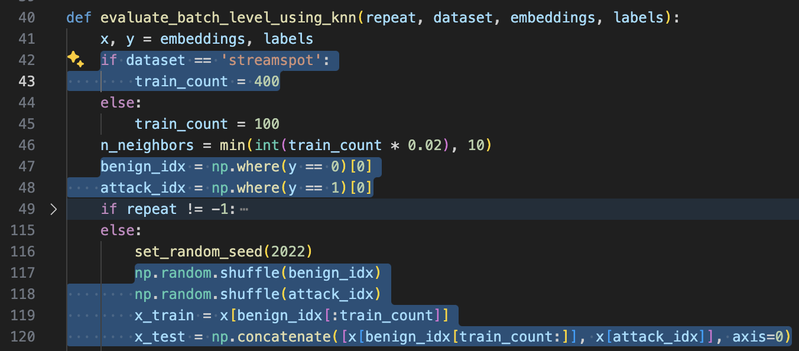
   
   3) Results using the given preprocessed data and pretrained model.

      

   4) Results using scratch implementation (preprocessing data and training model)

      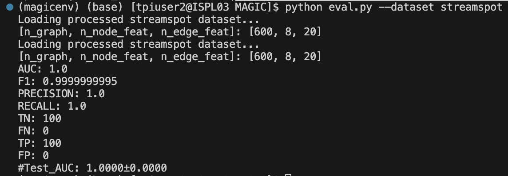

2) Wget:
   
   1) Results using the given preprocessed data and pretrained model.

      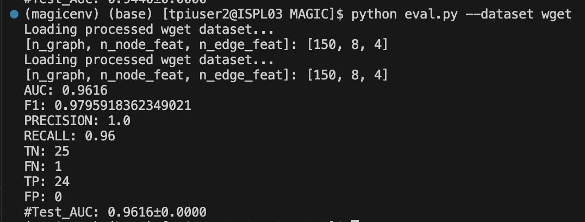

   2) Results using scratch implementation (preprocessing data and training model)

      

   3) There is a difference in results; contributed to an existing Github issue: <https://github.com/FDUDSDE/MAGIC/issues/13>
   
      1) (pointed out by [jiangdie666](https://github.com/jiangdie666) and [Jimmyokok](https://github.com/Jimmyokok)) The loaddata.py assumes first 25 graphs loaded are attack graphs followed by 125 benign graphs:

         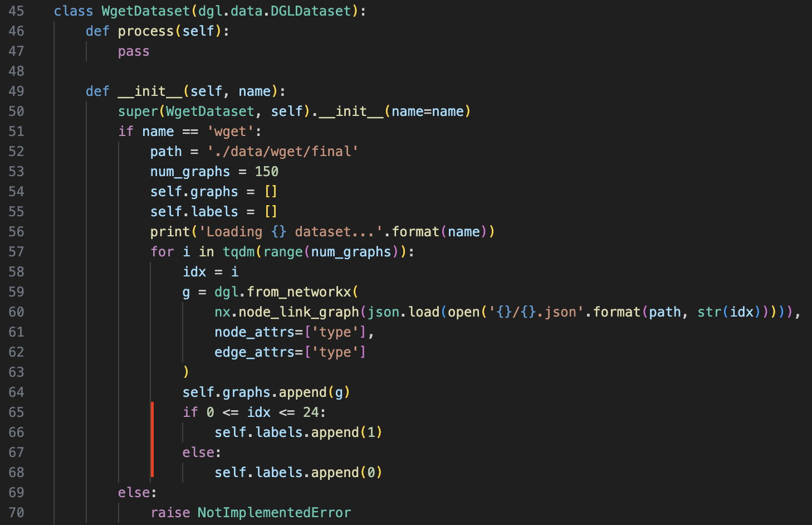

      2) However, in wget_parser.py the files are loaded in default order so the first 25 graphs loaded may not be attack graphs:

         

      3) Made the following edit:

         

      4) Following the edits metrics improved but still below those mentioned in the paper.
   
         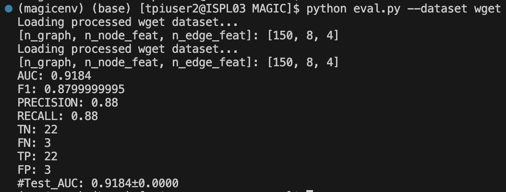
      
      5) The current seed set was 0, whereas the authors used a different seed. I tried using different seed values but still got the same results. It turned out that I changed the seed in one file (./eval.py) but it was again being changed in another file (./model/eval.py).
      
      6) The author made a change in commit 1.0.6 (11/10/2024) in the pooling mechanism. Previously only index nodes (Type 2) were being pooled, now 5 types are being pooled.
   
         
      
      7) Results:

         1) Using the given preprocessed data and pretrained model.

            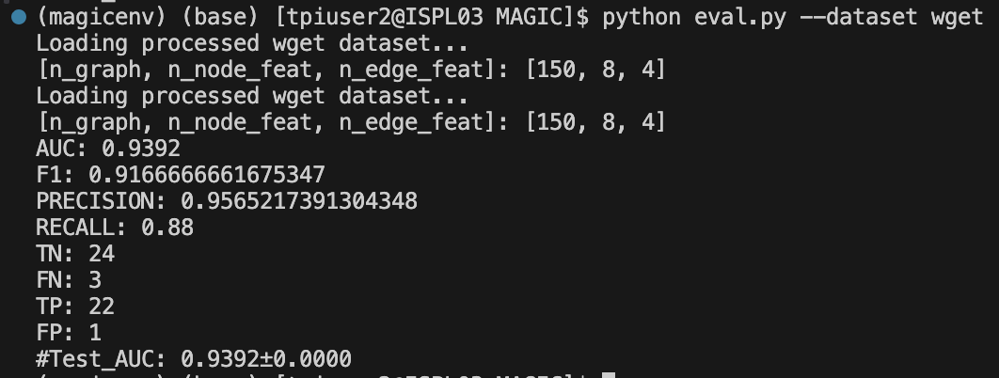

         2) Using scratch implementation (preprocessing data and training model)

            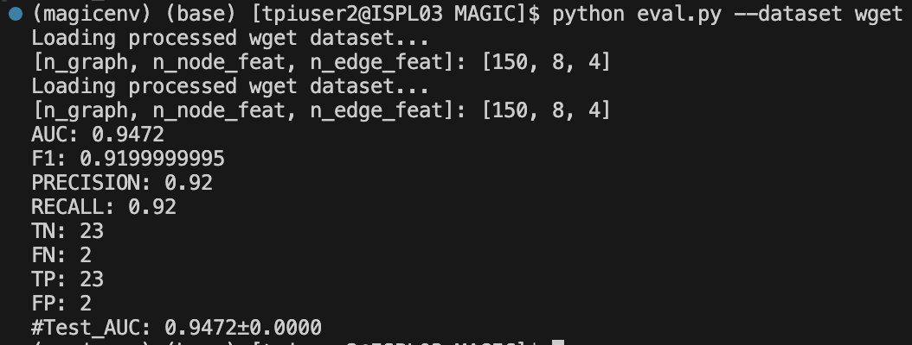

      8) Upon inquiring why only 5 types of nodes were included in pooling, the author mentioned that using all types of nodes in pooling lead to NaN values. However, he fixed the issues and pushed the code in commit 1.0.6 (12/10/2024).

         

         1) Author forgot to make changes in no-repeat evaluation setting:

            Issue:

            

            Fix:

            

      9) Results:

         1) Using the given preprocessed data and pretrained model.

            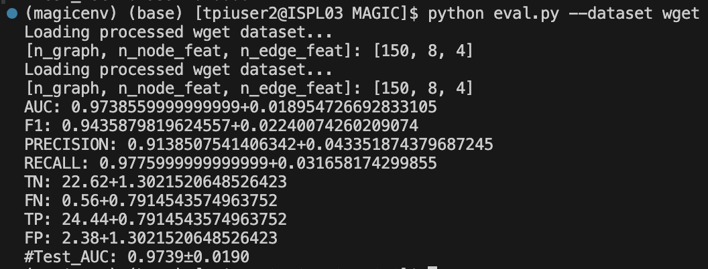

         2) Using scratch implementation (preprocessing data and training model)

            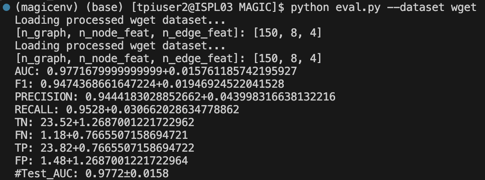

3) Trace:
   
   1) The preprocessing code refers to a file “ta1-trace-e3-official-1.json.0,” however no file of this name is found in the Trace dataset. It is most likely that they have misnamed “ta1-trace-e3-official-1.json” as  “ta1-trace-e3-official-1.json.0” in the code file *(the results do match if I rename “ta1-trace-e3-official-1.json” as  “ta1-trace-e3-official-1.json.0”)*

      
      
      

   2) ~~It is possible that some train files are used for evaluation as well as 3 same files can be seen included in train and test lists (refer to screenshot above). I found a section with a comment that it excludes the data that is the same between train and test. At a first glance, it should work however I still have to confirm this. If it works, I am not sure why the conflicting data was included in the test dataset in the first place.~~

   **Update:** 

      
      
      

   3) Results using the given preprocessed data and pretrained model.

      

   4) Results using scratch implementation (preprocessing data and training model)

      

4) Theia:
   
   1) Results using the given preprocessed data and pretrained model.

      

   2) Results using scratch implementation (preprocessing data and training model)

      

5) Cadets:
   
   1) Results using the given preprocessed data and pretrained model.

      

   2) Results using scratch implementation (preprocessing data and training model)
   
   
   
   3) Results do not match. 
      1) Created a Github issue: <https://github.com/FDUDSDE/MAGIC/issues/19> (No response yet)

## **Key Issues ([Detailed](https://docs.google.com/document/d/1ynkKNEqqJBW2bS1WlEwedDZWCBDJRdv7hTKiy7T2M18/edit?usp=sharing)):**

1) No requirement.txt
2) Dgl library issues on Mac and Windows
3) ~~Mismatch in streamspot dataset~~
4) Mismatch in ~~wget (data published in 2018 and last changed in 2018) and~~ cadets results
5) Use of training data for evaluation in streamspot and ~~trace~~

## **Github Issue 1 (Wget)** <https://github.com/FDUDSDE/MAGIC/issues/13>

1) Timeline:

   My Msg 1 -> 11 October 2024, 16:00  
   Response 1 ->  11 October 2024, 17:20  
   My Msg 2 -> 11 October 2024, 18:00  
   Response 2 ->  11 October 2024, 18:10  
   Response 3 ->  11 October 2024, 21:30  
   My Msg 3 -> 12 October 2024, 11:30  
   Response 4 ->  12 October 2024, 12:00  

## **Github Issue 2 (Cadets)** <https://github.com/FDUDSDE/MAGIC/issues/13>

1) Timeline:

   My Msg 1 -> 12 October 2024, 19:20  
